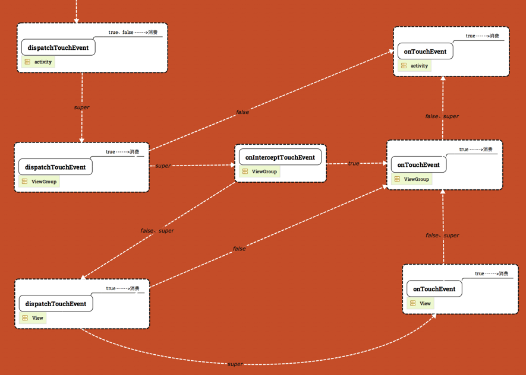

# View事件传递机制

如图所示 touch事件由 activity->viewgroup->view 的顺序调用 dispatchTouchEvent 如果 dispatchTouchEvent返回为false则事件不再向下传递，调用该层的onTouch（如果没有则调用onTouchEvent）然后如果该层的onTouch（onTouchEvent）返回为false则调用该层的上一层的onTouch（onTouchEvent）如果一路走来都没有就调用activity的onTouch（onTouchEvent）返回为true则该事件被消费

对于dispatchTouchEvent 返回 false 的含义应该是：事件停止往子View传递和分发同时开始往父控件回溯（父控件的onTouchEvent开始从下往上回传直到某个onTouchEvent return true），事件分发机制就像递归，return false 的意义就是递归停止然后开始回溯。

每个ViewGroup每次在做分发的时候，问一问拦截器要不要拦截（也就是问问自己这个事件要不要自己来处理）如果要自己处理那就在onInterceptTouchEvent方法中 return true就会交给自己的onTouchEvent的处理，如果不拦截就是继续往子控件往下传。默认是不会去拦截的，因为子View也需要这个事件，所以onInterceptTouchEvent拦截器return super.onInterceptTouchEvent()和return false是一样的，是不会拦截的，事件会继续往子View的dispatchTouchEvent传递。
