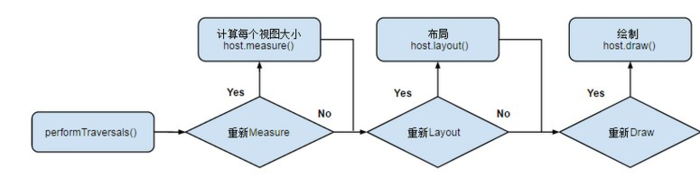

# View相关

## View的绘制流程

Activity启动时，ActivityThread.handleResumeActivity()方法中建立了decorView与ViewRoot的关联关系，当建立好了decorView与ViewRoot的关联后，ViewRoot类的requestLayout()方法会被调用，以完成应用程序用户界面的初次布局。实际被调用的是ViewRootImpl类的requestLayout()方法
上面的方法中调用了scheduleTraversals()方法来调度一次完成的绘制流程，该方法会向主线程发送一个“遍历”消息，最终会导致ViewRootImpl的performTraversals()方法被调用。

最终会导致ViewRootImpl的performTraversal会依次调用measure，layout，draw
measure阶段：TODO
layout阶段：TODO
draw阶段： TODO

## 自定义View如何考虑机型适配
    这里要考虑的是屏幕的问题：
    合理使用warp_content，match_parent.
    尽可能的是使用RelativeLayout
    针对不同的机型，使用不同的布局文件放在对应的目录下，android会自动匹配。
    尽量使用点9图片。
    使用与密度无关的像素单位dp，sp
    引入android的百分比布局。
    切图的时候切大分辨率的图，应用到布局当中。在小分辨率的手机上也会有很好的显示效果。

## 自定义View如何提供获取View属性的接口；TODO 点击事件之类的

## 自定义View过程：onMeasure()、onLayout()、onDraw()
    * onMeasure() 方法：单一 View，一般重写此方法，针对 wrap_ content 情况，规定 View 默认的大小值，避免于 match_parent 情况一致。ViewGroup，若不重写，就会执行和单子View 中相同逻辑，不会测量子 View。一般会重写 onMeasure() 方法，循环测量子 View。
    * onLayout()方法:单一 View，不需要实现该方法。ViewGroup 必须实现，该方法是个抽象方法，实现该方法，来对子 View 进行布局。
    * onDraw() 方法：无论单一View，或者 ViewGroup 都需要实现该方法，因其是个空方法

## 事件传递及滑动冲突的处理 TODO
    事件传递理解成责任链式调用就好，也就是从最内层到外层时间委派，如果事件consume了，那么就给这个view处理，不然从外向内冒泡，
    冲突处理举个实例就好，比如SlideMenu与banner或者ListView与Scrollview的冲突等等，说出基本思路就行，这些解决一般都是重写那几个事件方法，然后各种判断就好

理解Window和WindowManager
RemoteView的应用

SurfaceView
SurfaceView和View的区别

Dialog和Toast可以在Service中弹出吗？Dialog和Toast的本质区别是怎样的？

## validate和postValidate的区别
前者在UI线程中使用，后者在非UI线程中使用

自定义 View 的注意事项

## ListView卡顿原因，ListView优化
Adapter的getView方法里面convertView没有使用setTag和getTag方式；
在getView方法里面ViewHolder初始化后的赋值或者是多个控件的显示状态和背景的显示没有优化好，抑或是里面含有复杂的计算和耗时操作；
在getView方法里面 inflate的row 嵌套太深（布局过于复杂）或者是布局里面有大图片或者背景所致；
Adapter多余或者不合理的notifySetDataChanged；
listView 被多层嵌套，多次的onMeasure导致卡顿，如果多层嵌套无法避免，建议把listview的高和宽设置为fill_parent. 如果是代码继承的listview，那么也请你别忘记为你的继承类添加上LayoutPrams，注意高和宽都是fill_parent的；