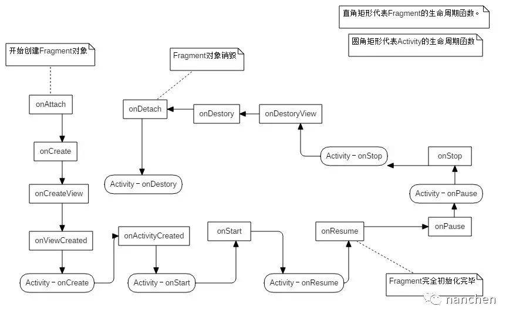

## Activity：
* 启动 Activity：onCreate -> onStart() -> onResume(), Activity 进入运行状态
* Activity 退居后台 ( Home 或启动新 Activity ): onPause() -> onStop()
* Activity 返回前台: onRestart() -> onStart() -> onResume()
* Activity 后台期间内存不足情况下当再次启动会重新执行启动流程
* 锁屏: onPause() -> onStop()
* 解锁: onStart() -> onResume()

## Fragment:
* 创建 Fragment: onAttach() -> onCreate() -> onCreateView() -> onActivityCreate() -> onStart() -> onResume()
* 销毁 Fragment: onPause() -> onStop() -> onDestroyView() -> onDestroy() -> onDetach()
* 从返回栈中回到上一个 Fragment: onDestroyView() -> onCreateView() -> onActivityCreated() -> onStart() -> onResume()

## Activity与Fragment数据传递:
* Fragment中通过getActivity()然后进行强制转化，调用Activity中的公有方法
* setArguments
* 广播



## Activity 的启动流程 TODO
## Service 的启动流程 TODO
## startActivityForResult是哪个类的方法，在什么情况下使用

## Activity 如何显示到屏幕上

## Service多次解绑
    绑定服务，首先要做的事情就是先用Map记录当前绑定服务所需的一些信息。 然后启动服务。
    解绑服务，先从早前的Map集合中移除记录，然后停止服务。
    如果再次解绑，无非就是再到这个map集合中找找有没有这条记录，没有就抛出服务没有注册的异常，也就是早前根本没有注册过任何服务。

## 如果在Adapter中使用startActivityForResult应该如何解耦
    * 最暴力的用广播
    * context强转成Activity

## Activity 的四种启动模式和特点
一个应用默认只有一个任务栈
* standard ( 标准模式 ) : 每次启动都会创建一个新的实例，并放入栈顶。（无法使用非 Activity 类的 Context 启动该模式的 Activity，如果启动需要加上 FlAG_ACTIVITY_NEW_TASK标记创建一个栈）。
* singleTop ( 栈顶复用模式 ) : 如果启动的 Activity 在栈顶，则该 Activity 不会重建，同时 Activity 的 onNewIntent() 方法会被调用，如果不在栈顶则通 standard 模式。
* singleTask ( 栈内复用模式 ) : 若启动的 Activity 在栈内，则不会创建新的实例调用 onNewIntent() 方法，并将该 Activity 上面所以的 Activity 清空（ 如果其他应用启动该 Activity，若不存在则简历新的 Task，若存在在后台，则后台 Task 也切换到前台）。
* singleInstance ( 单例模式 ) : 新的 Activity 直接创建新的任务栈，当该模式的 Activity 存在于某个栈中，后面任何激活该 Activity 都会重用该实例。

## Activity 的缓存方法
Activity 由于异常终止时（被系统判定要回收时），系统会调用 onSaveInstanceState()来保存 Activity 状态 (onStop() 之前和 onPause() 没有既定的时序关系)。
当重建时，会调用 onRestoreInstanceState()( onStart() 之后和 onPause() 没有既定的时序关系 )，并且把 Activity 销毁时 onSaveInstanceState() 方法所保存的 Bundle 对象参数同时传递给
onSaveInstanceState() 和 onCreate() 方法。因此，可通过 onRestoreInstanceState() 方法来恢复 Activity 的状态，该方法的调用时机是在 onStart() 之后。
onCreate()和 onRestoreInstanceState() 的区别：onRestoreInstanceState()回调则表明其中 Bundle 对象非空，不用加非空判断。onCreate() 需要非空判断。建议使用onRestoreInstanceState().

## 怎样退出终止App。
* 创建一个集合类对所有活动进行管理，ActivityCollector，通过 list 来管理 Activity。
* killProcess(android.os.Process.myPid()) 杀死当前程序进程。
    android中所有的activity都在主进程中，在Android manifest.xml中可以设置成启动不同进程，Service不是一个单独的进程也不是一个线程。
    当你Kill掉当前程序的进程时也就是说整个程序的所有线程都会结束，Service也会停止，整个程序完全退出。
* System.exit(0)
    当我们在写java程序时肯定用到过System.exit(0),它的意思是退出JVM（java虚拟机），在android中一样可以用，我们可以想像一下虚拟机都退出了当然执行System.exit的程序会完全退出，内存被释放。

## Activity 的缓存方法
Activity 由于异常终止时，系统会调用 onSaveInstanceState()来保存 Activity 状态 ( onStop() 之前和 onPause() 没有既定的时序关系 )。当重建时，会调用 onRestoreInstanceState()，并且把 Activity 销毁时 onSaveInstanceState() 方法所保存的 Bundle 对象参数同时传递给 onSaveInstanceState() 和 onCreate() 方法。因此，可通过 onRestoreInstanceState() 方法来恢复 Activity 的状态，该方法的调用时机是在 onStart() 之后。
onCreate()和 onRestoreInstanceState() 的区别：onRestoreInstanceState()回调则表明其中 Bundle 对象非空，不用加非空判断。onCreate() 需要非空判断。建议使用onRestoreInstanceState().

## Fragment状态保存
(Fragment状态保存)[http://blog.csdn.net/zephyr_g/article/details/53516568]

```java
public class MainFragment extends Fragment {

    // These variable are destroyed along with Activity
    private int someVarA;
    private String someVarB;

    ...

    @Override
    public void onSaveInstanceState(Bundle outState) {
        super.onSaveInstanceState(outState);
        outState.putInt("someVarA", someVarA);
        outState.putString("someVarB", someVarB);
    }

    @Override
    public void onActivityCreated(@Nullable Bundle savedInstanceState) {
        super.onActivityCreated(savedInstanceState);
        someVarA = savedInstanceState.getInt("someVarA");
        someVarB = savedInstanceState.getString("someVarB");
    }

}
```

## ApplicationContext和ActivityContext的区别
* Activity和Service以及Application的Context是不一样的,Activity继承自ContextThemeWraper.其他的继承自ContextWrapper
* 每一个Activity和Service以及Application的Context都是一个新的ContextImpl对象
* getApplication()用来获取Application实例的，但是这个方法只有在Activity和Service中才能调用的到。那么也许在绝大多数情况下我们都是在Activity或者Service中使用Application的，但是如果在一些其它的场景，比如BroadcastReceiver中也想获得Application的实例，这时就可以借助getApplicationContext()方法，getApplicationContext()比getApplication()方法的作用域会更广一些，任何一个Context的实例，只要调用getApplicationContext()方法都可以拿到我们的Application对象。
* Activity在创建的时候会new一个ContextImpl对象并在attach方法中关联它，Application和Service也差不多。ContextWrapper的方法内部都是转调ContextImpl的方法
* 创建对话框传入Application的Context是不可以的
* 尽管Application、Activity、Service都有自己的ContextImpl，并且每个ContextImpl都有自己的mResources成员，但是由于它们的mResources成员都来自于唯一的ResourcesManager实例，所以它们看似不同的mResources其实都指向的是同一块内存
* Context的数量等于Activity的个数 + Service的个数 + 1，这个1为Application

## 为什么在Service中创建子线程而不是Activity中
    这是因为Activity很难对Thread进行控制，当Activity被销毁之后，就没有任何其它的办法可以再重新获
    取到之前创建的子线程的实例。而且在一个Activity中创建的子线程，另一个Activity无法对其进行操作。但是Service
    就不同了，所有的Activity都可以与Service进行关联，然后可以很方便地操作其中的方法，即使Activity被销毁了，之后只要重
    新与Service建立关联，就又能够获取到原有的Service中Binder的实例。因此，使用Service来处理后台任务，
    Activity就可以放心地finish，完全不需要担心无法对后台任务进行控制的情况。

    ### 原有的Service中Binder怎么获取
        service的onBind 方法返回
        activity调用bindService与之关联

## Activity有几种启动模式？有什么区别？
    Activity启动有4种模式，区别如下：
    standard:Activity的每一次启动都会新建一个Activity实例，并将其压入任务栈的栈顶，而不管这个Activity是否存在，并且会走生命周期
    singleTop:栈顶复用模式，这种模式下，如果Activity已经位于任务栈的栈顶，那么此Activity不会被重新创建，所以他的启动三回调就不会执行，同时Activity的onNewIntent 方法会被回调，如果Activity已经存在但是不在栈顶，那么它的作用和standard一样。
    singleTask:系统创建新任务并实例化位于新任务底部的 Activity。但是，如果该 Activity 的一个实例已存在于一个单独的任务中，则系统会通过调用现有实例的 onNewIntent() 方法向其传送 Intent，而不是创建新实例。一次只能存在 Activity 的一个实例。
    singleInstance:单独创建一个新的任务栈。

## AlertDialog,popupWindow,Activity区别
    ？？ 感觉好老啊
    AlertDialog是非阻塞式对话框：AlertDialog弹出时，后台还可以做事情；
    而PopupWindow是阻塞式对话框：PopupWindow弹出时，程序会等待，在PopupWindow退出前，程序一直等待，只有当我们调用了dismiss方法的后，PopupWindow退出，程序才会向下执行。

## AndroidManifest的作用与理解
manifest文件的主要功能仍然是向Android声明应用程序的组件，及各项权限
## 安装Apk过程
APK是Android安装包，Dalvik和ART都是Android运行环境，ART是在高版本手机上替换Dalvik的。dex文件是源代码编译后打包生成的文件，
是APK的一个组成部分，安装时Dalvik将dex文件中可执行文件class.dex解压存储在本地的文件就是ODEX文件。ART运行生成的文件是OAT。
* 将apk文件复制到data/app目录
* 解析apk信息
* dexopt操作
* 更新权限信息
* 完成安装,发送Intent.ACTION_PACKAGE_ADDED广播

## ViewPager使用细节，如何设置成每次只初始化当前的Fragment，其他的不初始化
利用fragment的setUserVisibleHint方法

## 一个已经被bind启动的Service调用startService后生命周期是怎么样的
    不会走onCreate 但是会走onStartCommand（一开始想多了）

## Android启动模式；生命周期方法，onStart和inResume区别；onPause和onStop区别。如何使屏幕旋转不销毁Activity
    不设置Activity的android:configChanges时，切屏会重新回掉各个生命周期，切横屏时会执行一次，切竖屏时会执行两次
    设置Activity的android:configChanges=”orientation”时，切屏还是会调用各个生命周期，切换横竖屏只会执行一次
    设置Activity的android:configChanges=”orientation |keyboardHidden”时，切屏不会重新调用各个生命周期，只会执行onConfigurationChanged方法

## 一个电话打进来，会调用什么生命周期
onPause(A) -> onCreate(B) -> onStart(B)-> onResume(B) -> onStop(A)

显式Intent：即直接指定需要打开的Activity类，可以唯一确定一个Activity，意图特别明确，
所以是显式的。设置这个类的方式可以是Class对象（如SecondActivity.class），也可以是包名加类名的字符串。应用程序内部Activity跳转常用这个方式。
隐式Intent:，隐式不明确指定启动哪个Activity，而是设置Action、Data、Category，让系统来筛选出合适的Activity。筛选是根据所有的


## Service的启动方式；如何使service在新的进程中启动；
    android:process=".process"
    然后利用隐式启动

## 如何保活一个进程
6.0 有个schedule啥啥啥的

* 提供进程优先级，降低进程被杀死的概率
方法一：监控手机锁屏解锁事件，在屏幕锁屏时启动1个像素的 Activity，在用户解锁时将 Activity 销毁掉。
方法二：启动前台service。
方法三：提升service优先级：
在AndroidManifest.xml文件中对于intent-filter可以通过android:priority = "1000"这个属性设置最高优先级，1000是最高值，如果数字越小则优先级越低，同时适用于广播。
* 在进程被杀死后，进行拉活
方法一：注册高频率广播接收器，唤起进程。如网络变化，解锁屏幕，开机等
方法二：双进程相互唤起。
方法三：依靠系统唤起。
方法四：onDestroy方法里重启service：service +broadcast 方式，就是当service走ondestory的时候，发送一个自定义的广播，当收到广播的时候，重新启动service；
* 依靠第三方
根据终端不同，在小米手机（包括 MIUI）接入小米推送、华为手机接入华为推送；其他手机可以考虑接入腾讯信鸽或极光推送与小米推送做 A/B Test。


## 为什么Dialog不能用Application的Context
Dialog初化始时是通过Context.getSystemServer 来获取 WindowManager，而如果用Application或者Service的Context去获取这个WindowManager服务的话，会得到一个WindowManagerImpl的实例，这个实例里token也是空的。
之后在Dialog的show方法中将Dialog的View(PhoneWindow.getDecorView())添加到WindowManager时会给token设置默认值还是null。
如果这个Context是Activity，则直接返回Activity的mWindowManager，这个mWindowManager在Activity的attach方法被创建，Token指向此Activity的Token，mParentWindow为Activity的Window本身

那为什么一定要是Activity的Token呢？我想使用Token应该是为了安全问题，通过Token来验证WindowManager服务请求方是否是合法的。
如果我们可以使用Application的Context，或者说Token可以不是Activity的Token，那么用户可能已经跳转到别的应用的Activity界面了，但我们却可以在别人的界面上弹出我们的Dialog，想想就觉得很危险。

## View的测量宽/高和最终宽/高有什么区别（另一种问法: view 的 getMeasuredWidth 和 getWidth 有什么区别）

* 在 View 的默认实现中 View 的测量宽/高和最终宽/高是相等的，只不过 测量宽高（getMeasureWidth/Height）是在 view 的 measure 过程中调用的，
而 view 的 最终宽高（getWidth/Height）是在 view 的 layout 过程中调用的;即两者的赋值时机不同，测量宽高比最终宽高获取的时机稍微早点;

* 在一般开发中这两者的值是一样的，但是也会存在特殊情况，
比如在 view 的 layout 方法中:
```java
public void layout(int l, int t, int r, int b){
     super.layout(l, t, r+100, b+100);
}
```
这个步骤就会导致测量宽高比最终宽高小 100px

另一种情况是在某些情况下 View 需要多次 measure 才能确定自己的测量宽高，在前几次的测量宽高过程中得出的值可能和最终宽高的不一致，但最终来说：测量宽高和最终宽高相等
